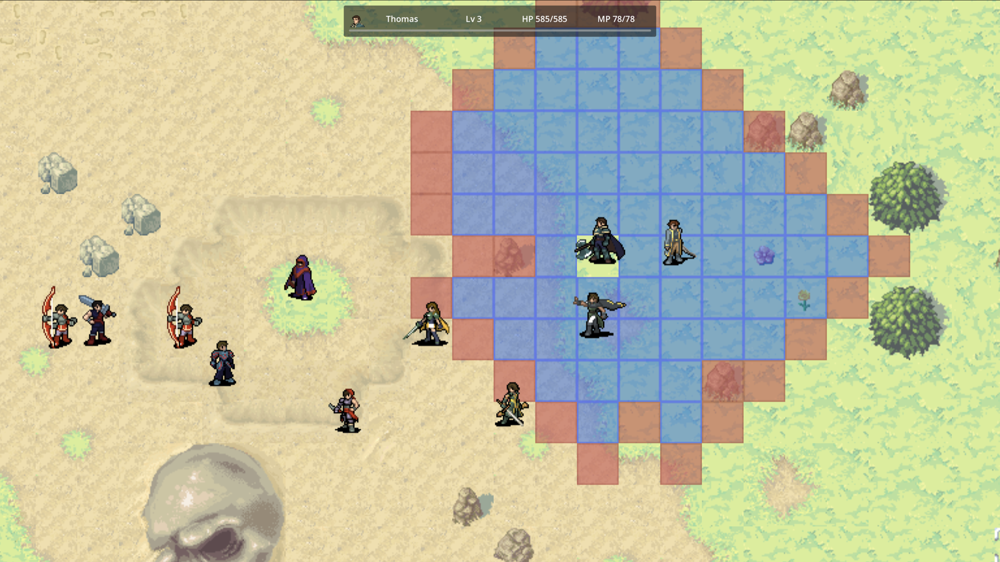

<h1 align="center">Re: Genesis</h1>

<p align="center">
  <em>A grid-based tactical RPG about a losing rebellion — and the people still fighting it.</em>
</p>

<p align="center">
  
  
  
</p>

<p align="center">
  <a href="https://github.com/anontriton/regenesis-builds/releases"><strong>⬇ Download the latest build</strong></a>
</p>

---

<p align="center">
  
</p>

<p align="center"><sub>Selecting a unit shows its whole reach at once: blue for where it can move, red for every tile it could strike after moving there.</sub></p>

---

## About

**Re: Genesis** is a turn-based tactics game in the tradition of *Fire Emblem* and *Final Fantasy Tactics*, built solo in Godot 4 as my master's capstone project at Tufts University.

Two years into the Genesis Rebellion, the Rathos Empire has not broken. You play Thomas, one of the rebellion's commanders, sent downriver to the neutral settlement of Yore to beg for steel and grain before an Imperial legion arrives to take both. It does not go well.

This build is a **vertical slice** — one complete chapter that runs the full game loop, on systems built to carry a longer campaign.

## Install

Download the file for your platform from the [**Releases page**](https://github.com/anontriton/regenesis-builds/releases).

The game needs no installer and runs on modest hardware — it uses Godot's OpenGL compatibility renderer, so integrated graphics are fine. It opens at 1920×1080 fullscreen. **Use a mouse if you can.**

> [!IMPORTANT]
> These builds aren't code-signed, because I don't have a paid Apple or Microsoft developer certificate. Both operating systems will warn you the app is unrecognized. The steps below are how you tell your OS to run it anyway — you'll only need to do this once.

### Windows 10/11

1. Your browser may block the download itself. Choose **Keep** → **Keep anyway**.
2. Run `ReGenesis Windows <version>.exe`. Windows shows a blue *"Windows protected your PC"* box.
3. Click **More info**, then **Run anyway**.

If there's no "More info" link, right-click the `.exe` → **Properties** → check **Unblock** at the bottom of the *General* tab → **OK**, then run it again.

### macOS 11+ (Apple Silicon & Intel)

1. Open the `.dmg` and drag **Re: Genesis** to your Applications folder.
2. Launching it normally gives you *"Re: Genesis is damaged and can't be opened"* — this is the quarantine flag, not actual damage.
3. Open Terminal and run:

   ```bash
   xattr -dr com.apple.quarantine "/Applications/Re: Genesis.app"
   ```

4. Open the app normally.

If you'd rather not use Terminal: try right-click the app → **Open** → **Open**. On newer macOS versions, launch it once, then go to **System Settings → Privacy & Security**, scroll to the message about Re: Genesis being blocked, and click **Open Anyway**.

## How to play

You command the Genesis rebels. Wipe out the Rathos forces before they wipe out you. Lose a unit marked essential and the battle ends immediately.

**The core loop:** click a unit → click where to go → click who to hit. A unit can **move and attack in the same turn**, so the tile you pick matters as much as the target. When all your units have acted, the enemy takes its turn.

| Input | Action |
| --- | --- |
| **Left click** | Select a unit, then confirm a destination or target |
| **Left click again** | Open the selected unit's action menu |
| **Right click + drag** | Pan the camera |
| **Mouse wheel** | Zoom in / out |
| **1 – 4** | Command · Ability · Item · Wait |
| **Enter** | Confirm an attack · advance dialogue |
| **Esc** | Cancel targeting, or open the battle menu |
| **Tab** | Muster Roll — party roster and unit stats |

**Reading the board.** Selecting a unit paints its reach in two colors: **blue** is where it can move, **red** is everything it could attack — tiles it can hit from wherever it's able to move first. So an enemy standing on red is one you can reach and attack this turn, even if it looks far away. Once a unit has moved, the overlay narrows to its plain attack range from where it now stands.

Before any attack you get a forecast — damage, hit chance, crit chance, who strikes first, and a warning if the blow is lethal — so you can back out before committing.

**Three things that will kill you if you ignore them:**

- **Counterattacks.** If your target survives and you're in its range, it hits back. Attacking with a fragile unit into something that lives is how you lose it.
- **Type matching.** Weapons beat armor in a triangle (Blunt › Heavy, Slash › Medium, Pierce › Light), and elements run Fire › Ice › Wind › Earth › Lightning › Water › Fire. A good matchup deals 1.25–1.5× damage; a bad one costs you 20–50%.
- **Getting surrounded.** Enemies gain accuracy and crit chance for each of their allies next to your unit — and the AI knows it. It presses when it outnumbers you locally and backs off when isolated.

**Use your support.** Calla heals and buffs, items work from the global inventory, and abilities cost MP. You get one item per unit per turn and it doesn't consume the unit's action — so healing and attacking in the same turn is often the right play.

## Core systems

- **Tactical movement** — terrain costs vary by unit, so a mage crossing sand pays a different price than a knight. Range overlays fold movement and attack into one picture, showing everything a unit can hit *after* moving rather than only from where it stands.
- **Combat math** — physical/special attack and defense split, damage variance, luck-scaled criticals, speed-scaled accuracy, counterattacks, and a glancing-damage floor so heavily armored units still take chip damage.
- **Enemy AI** — scores every possible action by expected damage, target health, accumulated aggro, positional safety, and ally proximity, with a small random term so the same map doesn't replay identically. Enemy healers triage, prioritizing allies in critical condition.
- **Party progression** — 7 protagonists with distinct roles, 20 abilities, and 12 weapons. Units keep their levels, HP, and equipment between battles.
- **Story delivery** — visual-novel dialogue with portraits between battles, plus a scripting system that fires popups, reinforcements, camera moves, and objective changes mid-fight.

## Status & what's next

Version **0.0.29** is the capstone presentation build: one chapter, complete and playable, built to prove the systems underneath it.

Not in yet — **saving** (the menu option is disabled rather than hidden), **more chapters** (the content pipeline handles them; authored maps and story are the bottleneck), **full attack animations** (the battle UI reserves a window for them), and **escort/seize objectives**. Known rough edges: buff effects stack where they should refresh, and the combat forecast omits a couple of situational crit bonuses that the real attack applies.

## Source code

This repository hosts playable builds only — the source lives in a private repository. It's roughly 15,000 lines of GDScript: a two-layer architecture splitting campaign orchestration from battle logic, communicating over signals, with all content defined in JSON rather than code, and an in-engine test suite covering the combat math and UI sequencing.

Happy to walk employers or collaborators through any of it — just reach out.

## Credits

Designed, programmed, and written by **Iverson Lai**. Built with [Godot Engine](https://godotengine.org/) 4.4.

---

<p align="center"><sub>© Iverson Lai. All rights reserved. Builds are provided for evaluation and play; the game's code and assets are not licensed for redistribution or reuse.</sub></p>

<!-- simulated web edit -->
